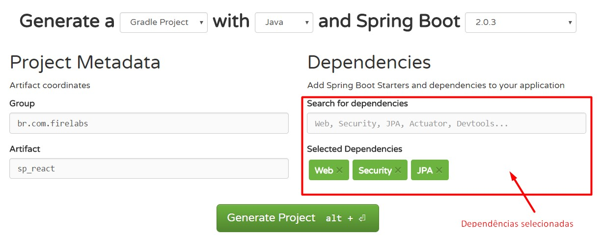

# Projeto Spring Boot + React

# Aplicação back-end

## Instalar o Gradle
https://gradle.org/install/

## Gerar o spring initilizer

**Acessar o site do spring**

[https://start.spring.io/](https://start.spring.io/)

**Configurar o padrão com as seguintes informações:**




# Aplicação Front-End (REACT)

```sh
npm install -g create-react-app

create-react-app front-app
```

>A aplicação de front-end foi criada com o nome de 'front-end'